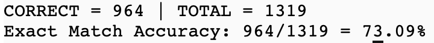

# QLoRA-style Fine-Tuning of LLaMA 2 with Manual GPTQ Quantization

This project implements a complete, from-scratch pipeline for efficient fine-tuning of LLaMA 2-7B using:

- Manual **GPTQ quantization** of attention layers
- Injection of custom **LoRA adapters** into quantized weights
- Fine-tuning on **GSM8K** (Grade School Math) dataset
- Custom evaluation logic with exact-match accuracy

All logic is built using raw PyTorch and Hugging Face Transformers, without external libraries like `bitsandbytes`, `peft`, or `qlora`.

---

## File Overview

### `quant_matmul.py`
Implements low-level quantized matrix multiplication logic used by GPTQ. Provides matrix-wise quantization functions that simulate integer-only arithmetic via scale/zero-point buffers.

### `gptq_quantizer.py`
Contains the `QuantizedLinear` module and `quantize_model_weights()` function.

- `QuantizedLinear` is a drop-in replacement for `nn.Linear` that uses manually quantized weights and stores scale/zero/weight_quant buffers.
- The `quantize_model_weights()` function performs calibration on a small dataset (e.g., prompts from GSM8K), gathers statistics, and replaces attention layers (q_proj, k_proj, etc.) with quantized versions.

### `lora.py`
Defines the `LoRALinear` module and `inject_lora_layers()` utility.

- `LoRALinear` wraps quantized weights and injects low-rank trainable adapters (A and B matrices) with proper scaling.
- `inject_lora_layers()` scans the model for quantized attention layers and replaces them with `LoRALinear`, copying over quantized weights and frozen biases.

### `dataset_loader.py`
Loads and formats the GSM8K dataset for fine-tuning and evaluation.

- `GSM8KCoTDataset` loads examples and formats them into CoT-style prompts.
- `format_gsm8k_entry()` helps standardize prompts and targets for each entry.

### `finetune.py`
Main script to quantize the base model and train LoRA adapters on GSM8K.

Steps:
1. Load `meta-llama/Llama-2-7b-hf` and calibrate weights with GPTQ
2. Inject LoRA adapters
3. Freeze base weights, enable gradient checkpointing
4. Fine-tune only LoRA parameters using NLL loss
5. Save:
   - `checkpoints/quantized_base_model.pt`
   - `checkpoints/lora_adapter.pt`

#### Run:
```bash
python finetune.py --batch_size 2 --epochs 3
```

---

### `eval_lora_gptq.py`
Loads the quantized model and LoRA weights and evaluates on GSM8K test split.

Steps:
1. Load quantized model and check for `QuantizedLinear` layers
2. Inject `LoRALinear` into attention layers
3. Load LoRA adapter weights
4. Generate predictions using greedy decoding
5. Extract predicted answers and compare with ground truth
6. Print batch-wise predictions and final accuracy

#### Run:
```bash
python eval_lora_gptq.py
```

#### Current EM Accuracy



---

## Setup

```bash
pip install torch transformers datasets
```
Make sure your GPU supports `bfloat16` (LLaMA 2 models expect bf16 or fp16).

---

## Model Used
- `meta-llama/Llama-2-7b-hf` (available on Hugging Face)

**Important:** You need access to download this model from Hugging Face.

---

## Notes
- Only attention projections (`q_proj`, `k_proj`, `v_proj`, `o_proj`) are quantized to 4-bit.
- LoRA is injected after quantization for accurate weight merging.
- Final accuracy on GSM8K test set is around **73.09%**, which is competitive with several published low-bit baselines.

---

## Future Work
- Add self-consistency decoding to boost accuracy
- Explore verifier-based reranking
- Try with larger training datasets like MetaMathQA or MathInstruct

